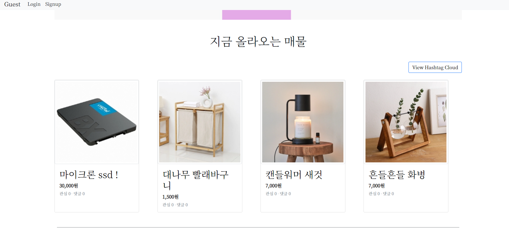
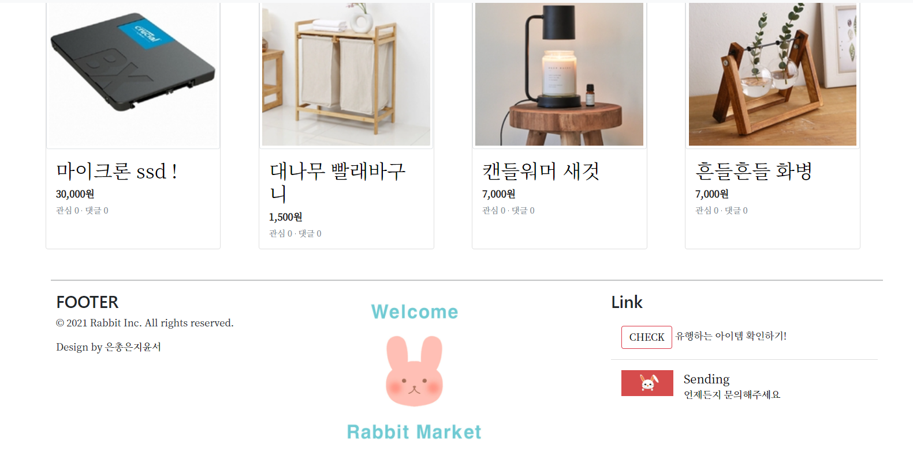
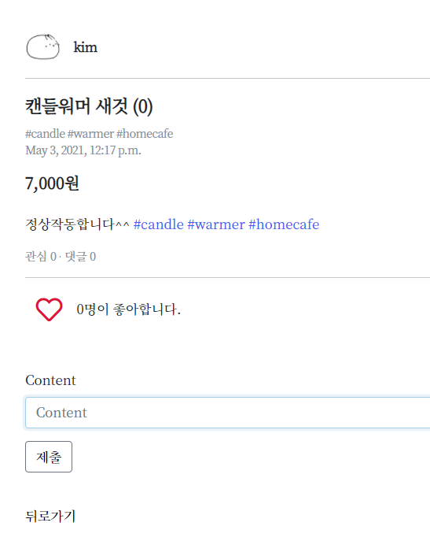
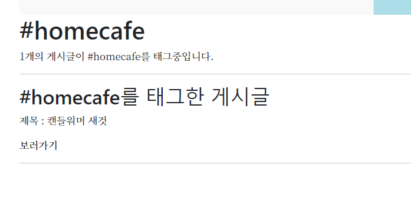
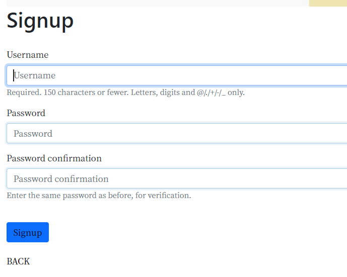
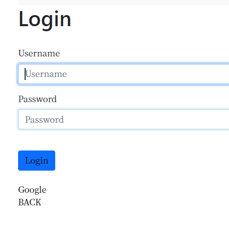
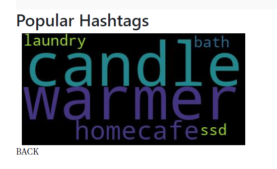
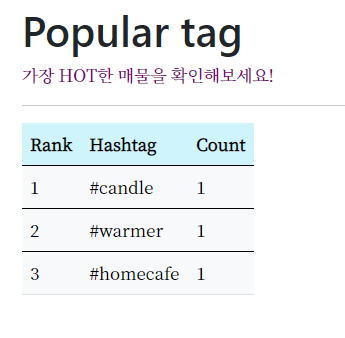
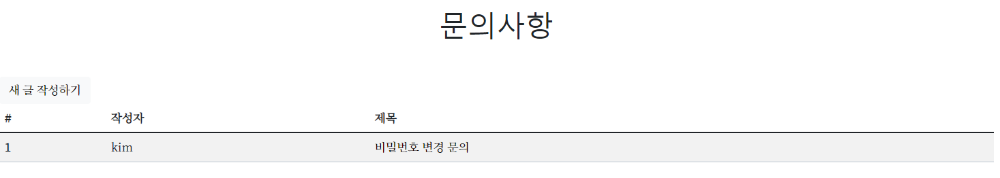

# 📰README

### 프로젝트 소개 

- 기간: 2021.03.24 - 2021.04.28
- 팀장: 김윤서
- 팀원: 이은총, 조은지 

### 프로젝트 개요 

- 주제: 중고 거래 웹 페이지 
- Django의 MVC 모델을 기반으로 서버 및 프론트 엔드 활용 

### 업무 분담

- 코드 설계, 코드 작성, 오류 해결 및 정리로 매 주 임의 배정 

### 완성 링크 

Git: https://github.com/ssw02238/Project2-django

Notion: https://www.notion.so/ee52004de6654caea66ce49301b6c2ce

### 목표 서비스 

- CRUD 기능 구현 
- static, media를 이용한 사진 게시 
- 반응형 웹 
- 단단한 페이지 만들기 (@required)

### 모델링

https://www.notion.so/576e199fcf784aa5914dc56baeaf1b99

### 진행 과정 

https://www.notion.so/57ea11217eea40f5abd9b4b3a2e405cb?v=f7ab1e278c744e94be67ffdb7d6d505f

### 완성 사진 

- #### 메인 화면 

- #### 게시글 

- #### 해시태그 

- #### Signup

- #### login

- #### Hashtag cloud 

- #### 유행하는 아이템 보러가기 

- #### 문의사항 

- #### 마이페이지 

